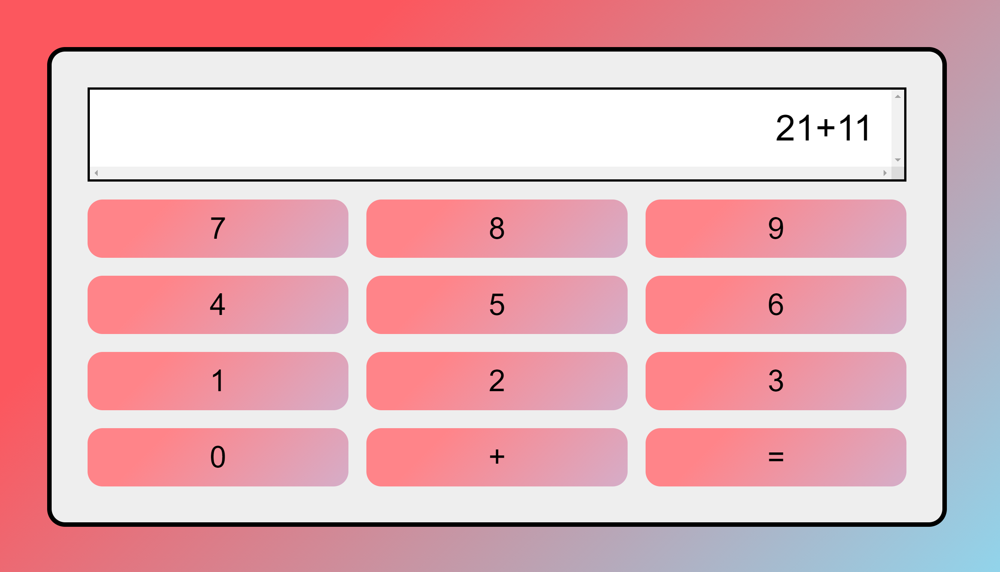

# Calculator

This is my first front-end project. The idea of the project is to recreate a similar Googl Calculator that can do addition. In the future, I want to work on adding multiplication, 
division so that it can be more functional to use in everyday tasks. 

If you are curious, you can try it out [here](https://calculator.mytran2111.repl.co/)
